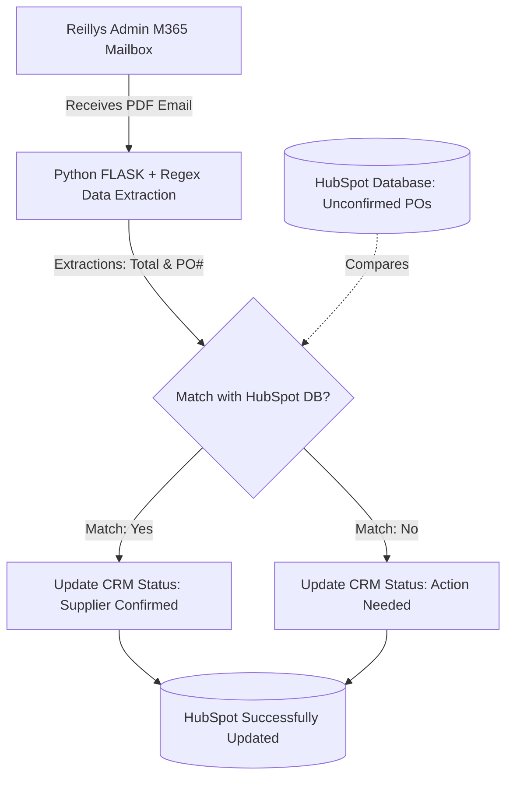
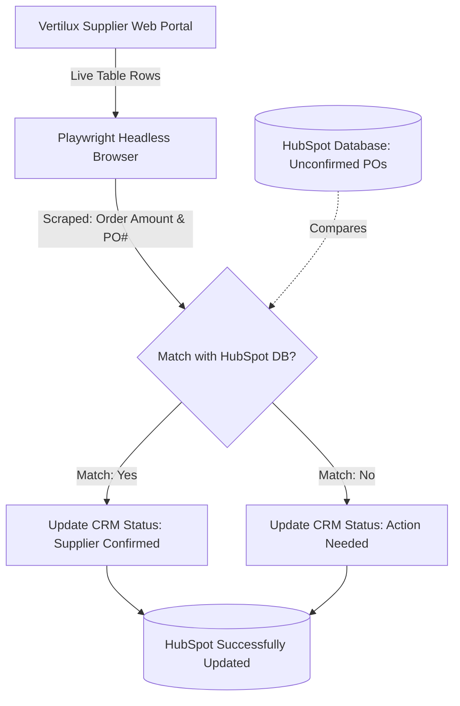

# Supplier PO & Invoice Automation Platform

This repository contains the prototype and production codebase for an end-to-end AI-driven document and portal automation system built for **Reillys**.

---

## 🚀 Application for SEEK (Cover Letter)

### 🤖 AI Tool Overview

**What it does:**
This AI tool is a dual-pipeline automated reconciliation system that entirely replaces manual invoice matching. It autonomously monitors, extracts, and validates supplier purchase orders (POs) and invoices to ensure they perfectly match the CRM records.

**Who uses it and Why:**
It is specifically built for the **Reillys Admin team**. Previously, the administration team had to manually open every email or regularly check supplier portals to confirm if supplier orders and pricing exactly matched the PO records existing in the HubSpot Database.

**The Value it delivers:**
By running this automation, the system eliminates 15-20 hours a week of grueling data entry for the Reillys Admin team. It automatically cross-references order values and catches critical price deviations (supplier quoted prices vs. internal PO budgets) instantaneously, turning a process that took days into seconds and practically eradicating human-entry errors prior to financial payments clearing.

---

## 🏗️ Architecture Breakdown

Because suppliers provide invoices differently, the system utilizes two distinct parallel approaches.

### 1. Approach 1: M365 Email AI Parser
Suppliers who issue invoices via email PDFs are processed completely headlessly utilizing Microsoft Graph.

**Workflow Summary:**
1.  The system listens to the Reillys M365 mailbox. 
2.  When a supplier sends an email, it intercepts the attachment.
3.  Algorithmically isolates the PO numbers and financial totals.
4.  Resolves and updates the Hubspot database to reconcile differences automatically.

**Workflow Diagram:**

**Technologies Used:**

| Technology | Application Context / Purpose |
|------------|---------|
| **Python & Flask** | Forms the core backend application structure and hosting webhook framework. |
| **Microsoft Graph API / OAuth2** | Establishes the secure client-credentials connection to fetch emails without manual logins. |
| **`pdfplumber`** | Drives the AI text extraction and OCR processing of the attached supplier PDF documents. |
| **HubSpot API (REST)** | Allows the final stage patching to write verified PO statuses directly to the CRM. |
| **Docker** | Containerizes the script, isolating dependencies so it runs securely on the cloud. |

---

### 2. Approach 2: Asynchronous Supplier Portal Scraper
Suppliers (like Vertilux) who utilize web dashboards rather than PDF emails are natively processed via dynamic headless browser scraping.

**Workflow Summary:**
1.  The application bypasses UI overlays and dialog modals to log into the supplier portal. 
2.  Scrapes active financial cells from the dashboard live tables.
3.  Cross-checks the live scraped data with the active HubSpot CRM tables automatically.

**Workflow Diagram:**

**Technologies Used:**

| Technology | Application Context / Purpose |
|------------|---------|
| **Python (Async)** | Acts as the main asynchronous worker logic to process tables simultaneously. |
| **Playwright (Chromium)** | Emulates a literal browser interface to navigate the DOM, close UI popups, and scrape JavaScript tables invisibly. |
| **Requests (Library)** | Handles the basic HTTP JSON requests updating the HubSpot CRM statuses. |
| **Docker** | Containerizes the hefty Chromium Playwright engine alongside the project logic for portable cloud deployment. |

---

## ☁️ Cloud Infrastructure (Azure to GCP)

**Prototype Phase (Microsoft Azure):** 
The system was originally prototyped and conceptualized using **Microsoft Azure**, heavily leveraging serverless Azure Functions and Microsoft 365 app registrations. *Because the Azure prototype handled live, sensitive financial data, the deployed endpoints cannot be externally shared for confidentiality reasons.*

**Production Phase (GCP Cloud Run):**
Following the prototype iteration, the architecture was seamlessly transitioned. The codebase was completely containerized via Docker and deployed onto **Google Cloud Platform (GCP) Cloud Run**. This pivot drastically optimized scaling and effectively reduced operational serverless hosting costs while maintaining peak computing performance.

---

### 🎥 Live Demo / Video Walkthrough
Please find the included video demonstration showcasing the automation natively running:

**[View Video Walkthrough Demo](./Reillys%20-%20Approach%202.mp4)**

*(Note: The `Reillys - Approach 2.mp4` video file is included in the root directory alongside this repository).*
